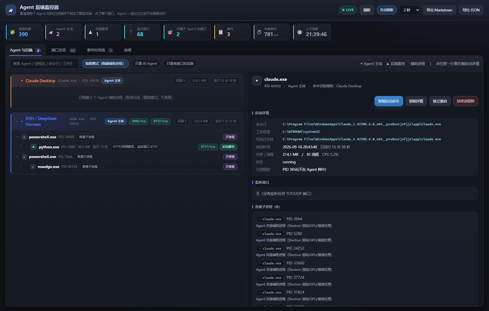
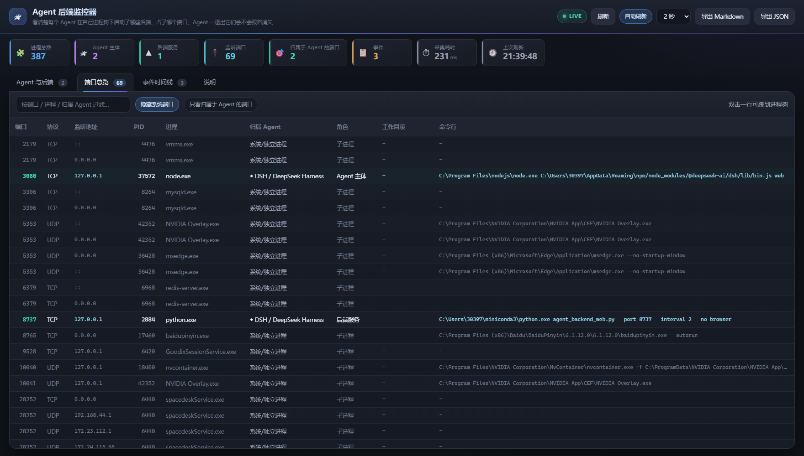

# Agent 后端监控器（Agent Backend & Port Monitor）

> 看清楚**每个 AI Agent 在自己进程树下启动了哪些后端**：用的什么命令行、什么工作目录、
> 监听了哪个端口、以及 **Agent 一退出这些后端会不会跟着消失**；
> 必要时还能**先释放端口、再用同一个端口把后端重新拉起来**。



- 桌面版：`agent_backend_monitor.py`（tkinter 图形界面，双击 `启动监控.bat`）
- 网页版：`agent_backend_web.py`（本机 127.0.0.1 上的网页界面，双击 `启动网页版.bat`）
- 两个界面共用同一套采集内核 `abm_core.py`，看到的数据完全一致

Windows + Python 3.8+，只依赖可选的 `psutil`（没有也能跑，见下文「关于 psutil」）。
MIT License。

| 端口总览 | 事件时间线 |
|---|---|
|  | 切到「事件时间线」页签即可看到后端启停与连带终止记录 |

---

## 它解决什么问题

很多 Agent 工具（Claude Code / Claude Desktop / Codex / DSH / Cursor / VS Code 扩展 …）
会把后端作为**自己的子进程**启动：本地 HTTP 服务、MCP server、语言服务器、数据库代理等。
父进程一退出，这些后端往往被一并收走，端口随即失效，排查时很难说清：
**是谁启动的？跑在哪？为什么没了？**

本工具把这件事摊开：

| 能力 | 说明 |
|---|---|
| Agent 进程树 | 按真实父子关系展开，标注角色：Agent 主体 / 后端服务 / 辅助进程 |
| 启动详情 | 完整命令行、工作目录、可执行文件、启动时间与运行时长、内存/线程/CPU、父进程链 |
| 端口总览 | 本机所有监听端口 → 占用进程 → 归属哪个 Agent（双击可跳到进程树） |
| 事件时间线 | 持续记录后端启动/退出、端口监听/释放，并生成「**Agent 退出 → 连带终止 N 个后端**」的关联事件 |
| 处置动作 | 结束进程树、复制启动命令、**重启并占回原端口**（先释放端口再用同一端口拉起）、导出 Markdown / JSON 报告 |

其中「**重启并占回原端口**」正是针对你遇到的痛点：它不会另开一个端口，而是

```
① 结束旧进程（及其子进程）            → 释放它占用的端口
② 轮询等待端口真正不再被监听           → 避免新进程 bind 失败
③ 用原命令行、原工作目录重新启动        → WMI / CreateProcess / 任务计划程序三级脱离 Agent
④ 再轮询确认同一个端口已经重新被监听     → 这才是"起来了"的判据
```

结果会如实回报，例如：*"已重启：旧进程 2 个已结束，端口 18090 已由新进程 PID 45940 重新监听"*；
若端口被别人占用或新进程没活下来，也会明确说明原因，不会假装成功。

实现上三种启动方式按可靠性依次尝试，并且**每一次都会等 1 秒确认新进程真的活着**：

| 顺序 | 方式 | 说明 |
|---:|---|---|
| 1 | **WMI `Win32_Process.Create`** | 新进程挂在 `WmiPrvSE.exe` 下，不继承监控器所在的 Job，最干净 |
| 2 | `CreateProcess` + `DETACHED_PROCESS \| CREATE_BREAKAWAY_FROM_JOB` | 常规脱离方式；Job 不允许 breakaway 时自动降级 |
| 3 | **任务计划程序** | 把命令写成临时 `.cmd` 交给 `schtasks` 执行，进程由计划程序服务拉起，用于最恶劣的环境 |

重启命令使用采集到的**原始参数列表**（argv）而不是重新分词后的命令行——
否则 `python -c "带空格的代码"` 这类参数会被拆碎，新进程启动即退出。

---

## 快速开始

```bat
:: 桌面版
启动监控.bat
:: 或者
python agent_backend_monitor.py

:: 网页版（自动打开 http://127.0.0.1:8737）
启动网页版.bat
:: 或者
python agent_backend_web.py --port 8737 --interval 2
```

要求：Windows + Python 3.8+，建议装 `psutil`（`pip install psutil`）。
没有 psutil 会自动降级用 PowerShell CIM 采集（信息较少）。

**建议以管理员身份运行**，否则以管理员身份启动的进程读不到命令行/工作目录。

### 关于 psutil（重要）

采集默认走 psutil；**如果启动监控的 Python 没装 psutil，会自动降级成 PowerShell CIM**。
降级模式仍能读到进程、端口、命令行，但会**丢掉工作目录等关键信息**——这会直接影响「重启后端」：
新进程可能落到 `C:\WINDOWS\system32`，于是 Vite / Next 这类服务"起来了却整站 404"。

为此加了三层防护：

1. `启动监控.bat` / `启动网页版.bat` 会**自动挑选装了 psutil 的解释器**
   （依次尝试 conda 和常见 Python 安装路径），实在找不到才退回默认 `python`；
2. 真的降级时，网页版会挂出**红色横幅**、桌面版会**弹窗**明确告知，不再静默降级；
3. 即使没有 psutil，监控也会**直接读目标进程的 PEB**（纯 ctypes）拿到工作目录与原始参数，
   重启后还会**比对新旧进程的工作目录**，不一致就告警。

```bat
:: 想彻底避免降级，装上 psutil 即可
python -m pip install psutil
```

---

## 怎么验证它对你有用

1. 先启动监控（桌面版或网页版都行）。
2. 正常用你的 Agent —— 比如在 Claude Code / Codex / DSH 里让它跑一条命令、
   打开一个项目、连一个 MCP server。
3. 回到监控界面，「Agent 与后端」里就会长出对应的后端进程（▲），
   端口、命令行、工作目录一览无余；「事件时间线」记录它们什么时候出现。
4. 关掉那个 Agent，再看事件时间线：

   ```
   warn  Agent「Claude Code (CLI)」(node.exe, PID 43210) 已退出 → 连带终止 2 个后端：
         node.exe(PID 44880，端口 3000/tcp)、python.exe(PID 45012)
   warn  后端退出：node.exe(PID 44880)，释放端口 3000/tcp
   ```

   这就是「关闭 Agent 后后端也关闭」的直接证据。想让它继续活着，
   就选中该后端点 **独立重启**，再重复第 4 步对比一次。

---

## 界面说明

### 桌面版

- **Agent 与后端**：左侧进程树（◆ Agent / ▲ 后端 / · 辅助进程），点任意一行，右侧显示完整启动详情；
  右键进程树可执行全部操作（复制详情/复制启动命令/打开所在目录/独立重启/结束进程树）。
- **端口总览**：所有监听端口及归属；默认隐藏系统端口，双击一行跳到进程树。
- **事件时间线**：可清空、可导出。
- **说明**：内置使用说明。
- 顶部可切换「精简模式（隐藏 Electron 渲染等辅助进程）」「只看 AI Agent」「只看有端口/服务的后端」，
  以及按关键字过滤。

### 网页版

同样的四个页签，另外：

- 顶部实时统计 + `LIVE` 指示；可暂停自动刷新、切换采样间隔。
- 一键下载 Markdown / JSON 报告。
- 页面地址支持锚点直达：`#agents` / `#ports` / `#events` / `#help`。
- 只监听回环地址，写操作需要页面内嵌的一次性 token，其他本地网页无法调用。

网页版接口（也可被别的脚本调用）：

```
GET  /api/snapshot            当前快照（进程树 + 端口 + 事件 + 统计）
GET  /api/report?format=md    下载报告（md / json）
POST /api/refresh             立即重新采集
POST /api/kill                {"pid": 123, "tree": true}
POST /api/relaunch            {"pid": 123}
POST /api/reload-rules        重新读取 config/agents.json
```

---

## 自定义识别规则

规则文件：`config/agents.json`（首次运行自动生成）。每条规则：

```json
{
  "id": "my-agent",
  "label": "我的 Agent",
  "category": "agent",
  "color": "#8bc34a",
  "proc": ["^node(\\.exe)?$"],
  "cmd":  ["my-agent[\\\\/]server"]
}
```

- `proc`：进程名正则（不区分大小写）
- `cmd`：命令行 / 可执行文件路径正则
- 两者**都**命中才算识别为这个 Agent（`cmd` 为空则只看进程名）
- 同一个 Agent 的多个进程只有"祖先链上没有命中同一条规则"的那个会被当主体，
  所以 Electron 的渲染/GPU 进程不会被误判成一堆独立 Agent
- 改完点桌面版「重新加载规则」，网页版点 `POST /api/reload-rules`（或重启服务）

已经内置识别：Claude Desktop、Claude Code、Codex CLI、Gemini CLI、Qwen Code、DSH、
Cursor、VS Code、Windsurf、Trae、Zed、Aider、OpenCode、Crush、Goose、Cline/Roo、Copilot CLI、Continue。

---

## 命令行用法

```bash
python agent_backend_monitor.py --report        # 打印 Markdown 快照报告
python agent_backend_monitor.py --json out.json # 导出 JSON 快照
python agent_backend_monitor.py --watch 3       # 每 3 秒刷新打印
python agent_backend_web.py --port 8737 --interval 2 --no-browser
```

---

## 文件结构

```
agent_backend_monitor.py   桌面版（tkinter 图形界面）＋ CLI 报告
agent_backend_web.py       网页版（本地 HTTP 服务 + 接口）
abm_core.py                采集内核：进程树、端口、角色判定、事件跟踪、报告生成
web/                       网页版前端（index.html / style.css / app.js）
docs/                      截图
config/agents.json         Agent 识别规则（首次运行自动生成，可编辑）
reports/                   导出的报告
LICENSE                    MIT
启动监控.bat / 启动网页版.bat / 生成报告.bat
```

---

## 常见问题

**Q：为什么我的 Agent 没被识别出来？**
在 `config/agents.json` 里加一条规则即可。先看它的命令行特征，例如
`node C:\Users\me\AppData\Roaming\npm\node_modules\@acme\agent\cli.js`，
那么 `proc: ["^node(\\.exe)?$"]`、`cmd: ["@acme"]` 就能命中。

**Q：某些进程的命令行是空的？**
那是以管理员身份运行的进程。用管理员身份启动本工具即可读到。

**Q：会不会很吃 CPU？**
采集内核做了针对性优化：用 `CreateToolhelp32Snapshot` 一次拿到全量进程，端口用系统
TCP 表，只有 Agent 与后端进程才会去补齐内存/线程/CPU。实测 400+ 进程一轮约 100~200ms。

**Q：结束进程树会不会误伤？**
会结束选中进程及其所有后代，点之前有确认框。不想动就只用「独立重启」。

**Q：为什么监控器自己显示成了别的 Agent 的后端？**
因为你就是从那个 Agent 的终端里启动它的 —— 这恰好说明检测是准确的。

**Q：Job 对象是什么？**
Windows 的进程组机制。Agent 把后端加入 Job 并设置 `KILL_ON_JOB_CLOSE` 后，
Agent 一退出（哪怕被强杀），系统会立刻连带杀掉这些后端 —— 这就是"关掉 Agent 后端也没了"的机制。
本工具在事件时间线里把这种连带终止记录下来，「独立重启」则用
`CREATE_BREAKAWAY_FROM_JOB | DETACHED_PROCESS` 尝试把它从 Job 里摘出来。

---

## 已知限制

- 仅支持 Windows（进程枚举、Job 观测、端口表都是 Windows 实现；核心逻辑有跨平台分支但未验证）。
- 事件时间线基于轮询（默认 2 秒），存活时间短于采样间隔的后端可能只留下"启动+退出"的合并记录。
- 「独立重启」会依次尝试 WMI / CreateProcess / 任务计划程序；如果三种方式的新进程都被上层环境
  立刻回收（例如监控器本身被跑在某个 Agent 严格管控的作业对象里），界面会明确告诉你失败原因，
  而不是假装成功。
- 页面与服务端之间用一次性令牌做写操作校验；令牌不同步时（例如服务重启后没刷新页面），
  界面会提示按 `Ctrl+F5` 重新加载，而不是静默失败。
